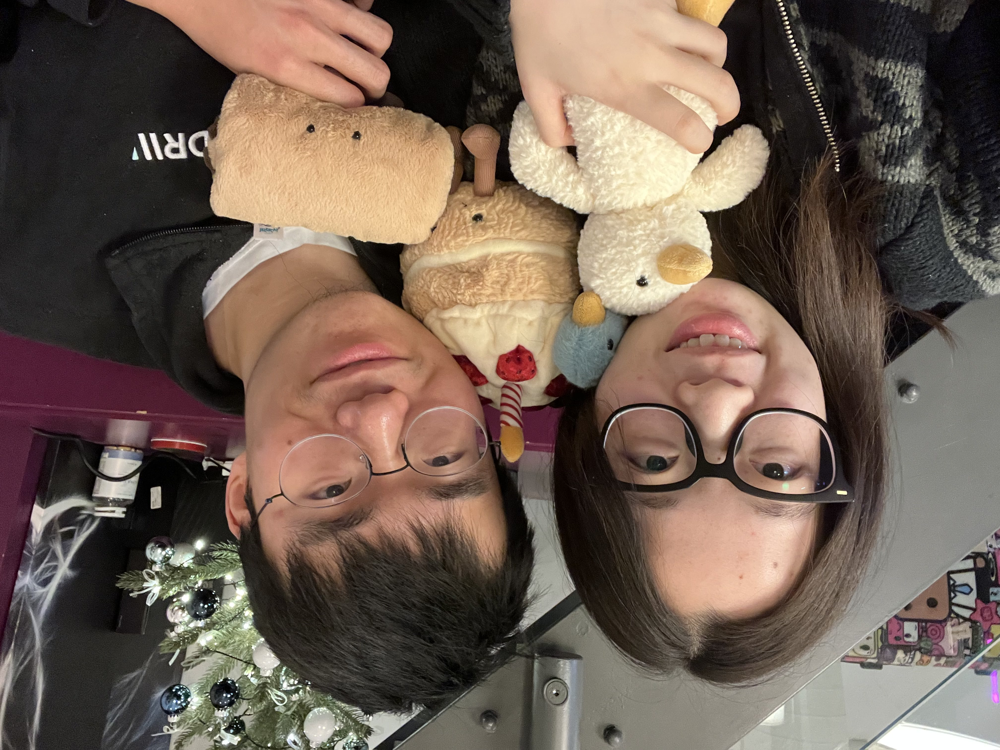

"Yu" is my given name, and "He" is my family name. Both of them unfortunately 
coincide with some English pronouns. 
Thanks to Singapore's effort in addressing different name orders,
I am used to being called as "He Yu" in the English context. 
Nowadays, I chose to go by "Heyu" for less (or maybe more) confusion. 

For Cambridge CompScis, here's some [advice for Part II dissertation](https://dransyhe.github.io/blog/2022/part-ii-dissertation/).

I am learning the Tibetan language, 
specifically the [Lhasa Tibetan](https://en.wikipedia.org/wiki/Lhasa_Tibetan).
My favourite thing in this world is [Baozi](https://en.wikipedia.org/wiki/Baozi), especially Tibetan momos. 
I explored all Tibetan restaurants I know in the UK.

A family photo of me & [Han](https://han.wales/):  
{:height="270px" width="360px"}
*feat. Millie, Molly, Poppy, and Sammy - left to right*

<!---
{:height="270px" width="360px" style="margin:auto; display:block;"}

<em>feat. Millie, Molly, Poppy, and Sammy - left to right</em>

-->

